<h1 align="center">Melodiy</h1>
<p align="center"></p>

<p align="center">
  <a href="https://github.com/DNYLA/Melodiy/pkgs/container/melodiy-server"></a>
  <a href="https://melodiy.net"></a>
  <a href="https://github.com/DNYLA/Melodiy/issues"></a>
  <a href="/LICENSE"></a>
</p>

Open Source Music streaming platform which allows users to combine publicly released music with their files whilst still being able to access your music from anywhere. Currently uses Spotify Api (optional) and YouTube to search and listen to publicly released music.

Built using Next.js and C#, Desktop and mobile applications are on the way soon.

The official Melodiy.net, which runs on the latest `dev` build (there may be bugs, as new features are tested on here too): [https://melodiy.net/](https://melodiy.net/)

### Contents

- [Screenshots](#screenshots)
- [Setup](#set-up)
- [Contributing](CONTRIBUTING.md)
- [Getting Help](#getting-help)

# Screenshots

<p align="center">

| Album                                                      |
| ---------------------------------------------------------- | 
| 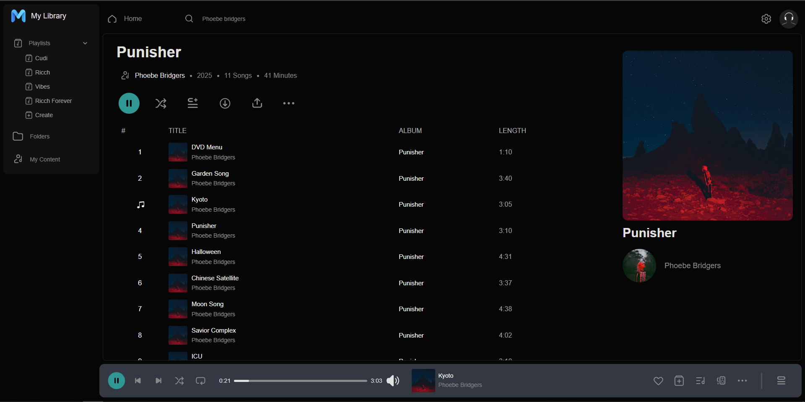 |

| Homepage                                                   | Your Files                                                              |
| ---------------------------------------------------------- | ----------------------------------------------------------------------- |
| 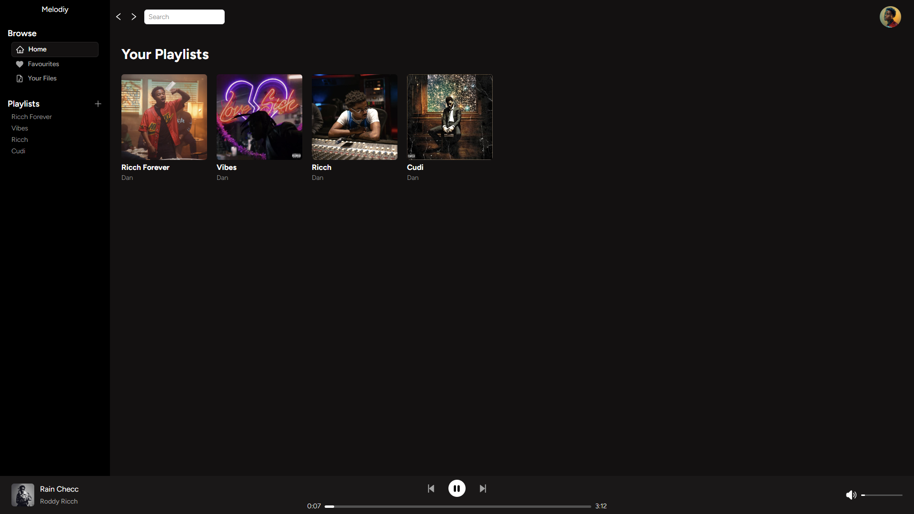 | 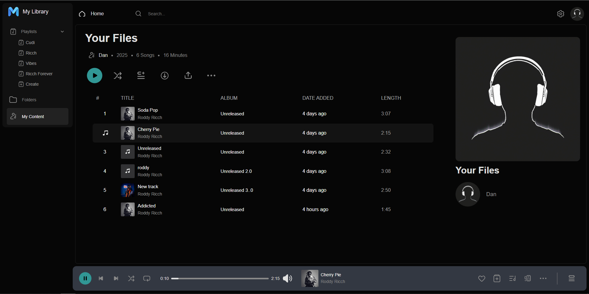 |

| Create Playlist                                            | Upload Song                                                             |
| -----------------------------------------------------------| ----------------------------------------------------------------------- |
| 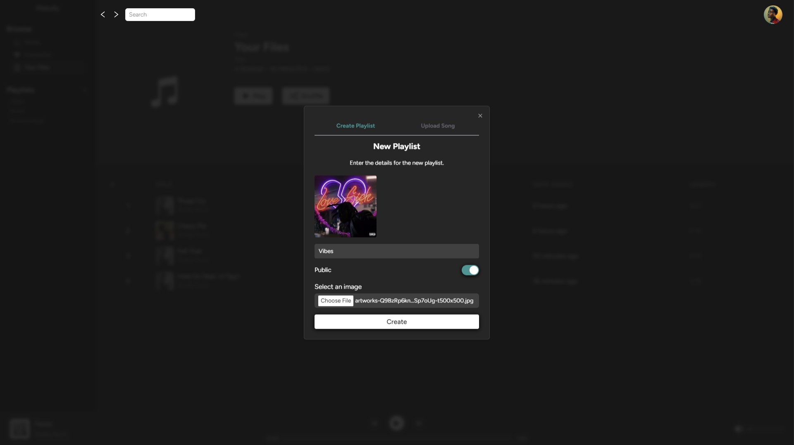 | 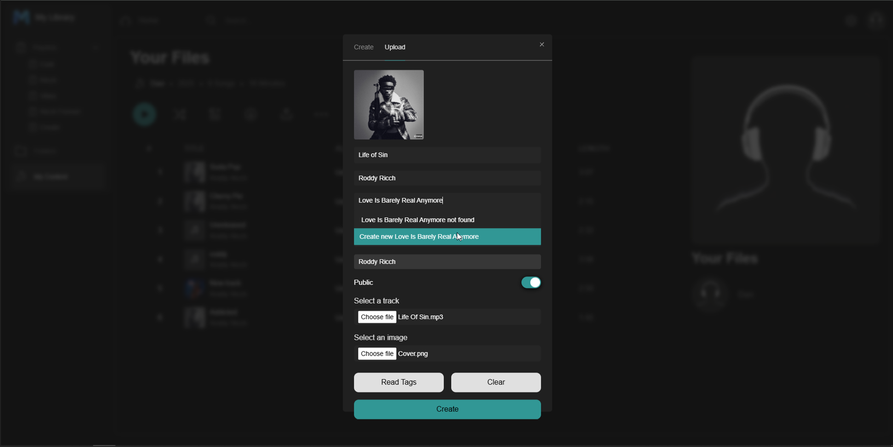 |

| Search                                                              | Search                                                           |
| ------------------------------------------------------------------- | ---------------------------------------------------------------- |
| 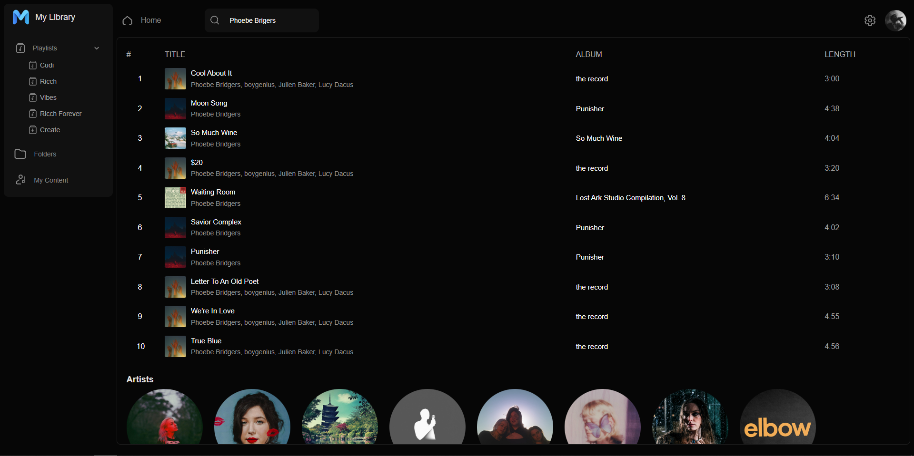 | 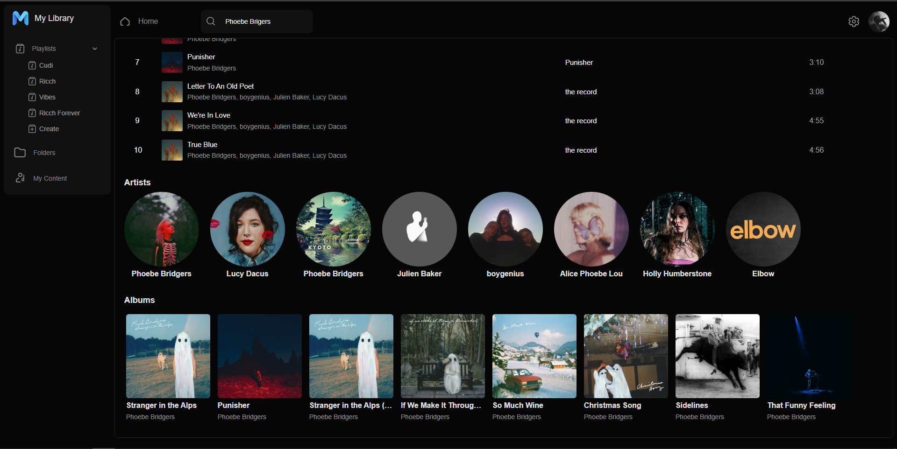 |

| Artist (Top Tracks)                                                 | Artist (Singles)                                                 |
| ------------------------------------------------------------------- | ---------------------------------------------------------------- |
| 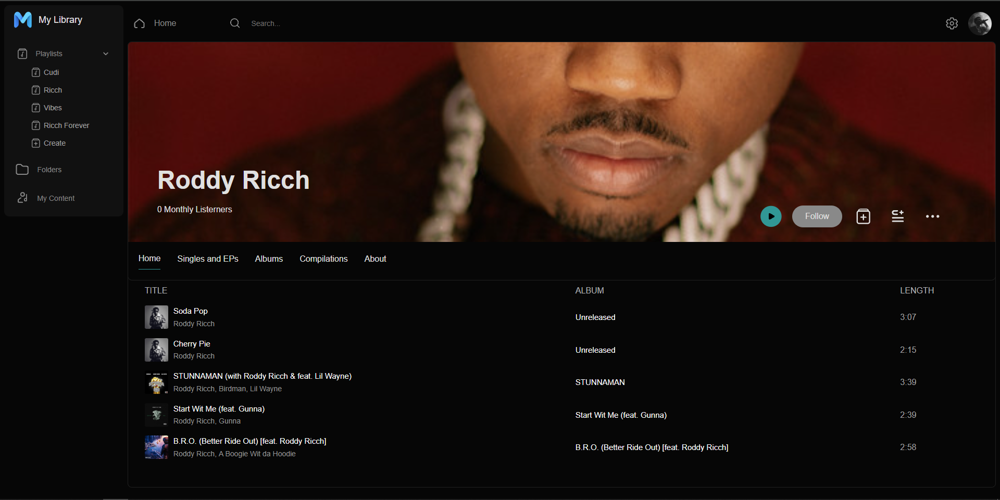 | 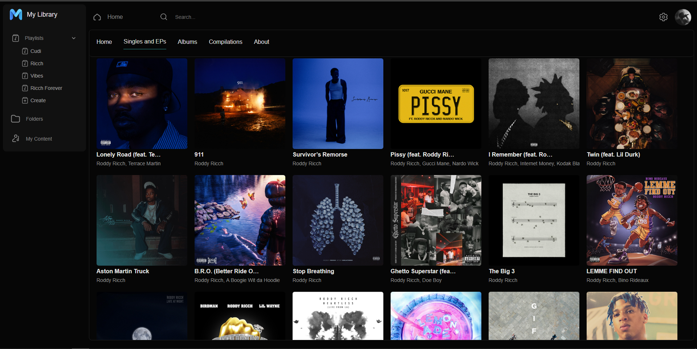 |

| Right Click Menu (Your Files)                                          | Right Click Menu                                              |
| ---------------------------------------------------------------------- | ------------------------------------------------------------- |
| 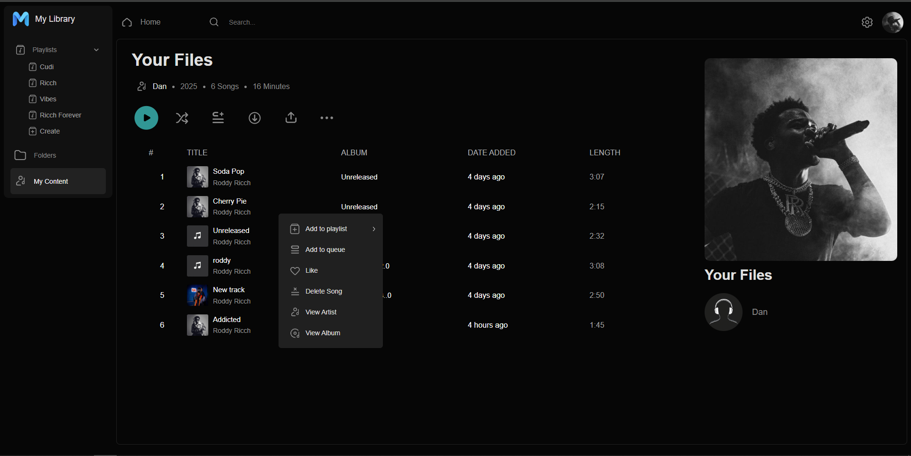 | 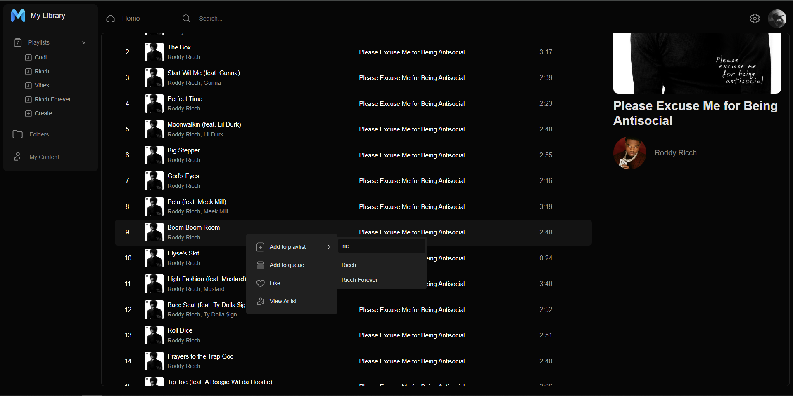 |

</p>

# Set Up

## Production
Setup is straightforward you can pull the latest image using **docker pull ghcr.io/dnyla/melodiy:latest**

Pre-requisites
* Postgress Database
* Docker
* Spotify Api Key (Optional Remove the "Spotify" section in app settings if you don't want to include Spotify searches).
* Supabase Application (Optional remove the "Supabase" section in app settings if you don't want to use Supabase as the CDN).

1. Pull the latest image using ```docker pull ghcr.io/dnyla/melodiy:latest```
2. Copy **docker-compose.yml** and **appsetting.json** and edit appsetting.json to include your Supabase (optional), Spotify (optional) and Database settings.
3. ```docker compose up``` to run the server.

### Caddy
In my production environments i use Caddy to host the web app to the public via a reverse proxy this way HTTPS certificates are generated and handled by caddy automatically. Below is my Caddyfile which reverse proxies the docker container, from memeory you will need to set up a docker network to achieve this however i forgot how to set this up and it was a litle complex my first time from what i remember. I will be migrated my app to another VPS before v2.0 is officially launched and will note down the steps and commands i used to create the network in the upcoming future.

```
melodiy.net {
  reverse_proxy 172.17.0.1:5129
}
```

### Supabase
If you want to use supabase as the CDN you need to set up the following function within supabase. This will become obsolete in future versions as i plan on making changes to not write the full URL for each file into the database and instead use identifiers and generate the URL whenever requested.

1. On your project for supabase navigate to Database -> Functions -> Create new Function.
2. Setup the new function like below

| Key        | Value               |
|------------|---------------------|
| Name       | storage_file_exists |
| Schema     | public              |
| Return Type | bool               |
| Arg1       | path (text)         |
| Arg2       | bucket (text)       |
| Definition | 
```
BEGIN RETURN
  (SELECT EXISTS
     (SELECT id
      FROM storage.objects
      WHERE bucket_id=BUCKET
        AND name=PATH
      LIMIT 1));
END;
```
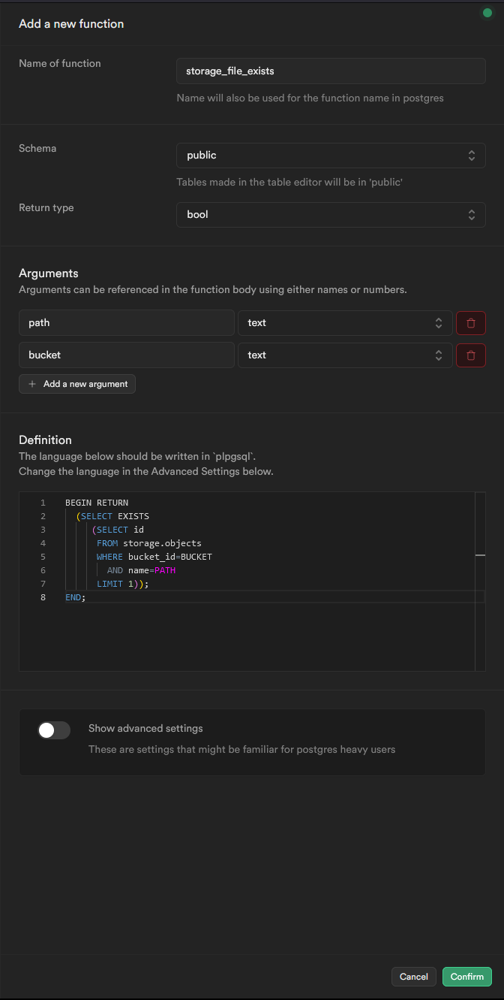

4. Leave everything else as default and click confirm.
5. Everything else (Bucket creation, database migrations, etc) will be handled by the server on every launch so no other setup is needed.

## Local Development

To setup local development you need to create an appsettings.development.json inside of the Melodiy.Web project. Https is optional for local development however you can enable it via Visual Studio by selecting https or alternatively you can run ```dotnet dev-certs https --trust``` followed by ```dotnet dev-certs https --trust``` if your on windows. Previous versions required https for local development however for now it is not needed and will work without. If you do chose to use https you will need to update the port used in the frontend.

# Getting Help

If something isn't working for you or you are stuck, Create an [issue](https://github.com/DNYLA/Melodiy/issues/new) or [discussion](https://github.com/DNYLA/Melodiy/discussions) if you need any help with setting up or have bug fixes/feature requests. is the best way to get help! Every type of issue is accepted, so don't be afraid to ask anything!
