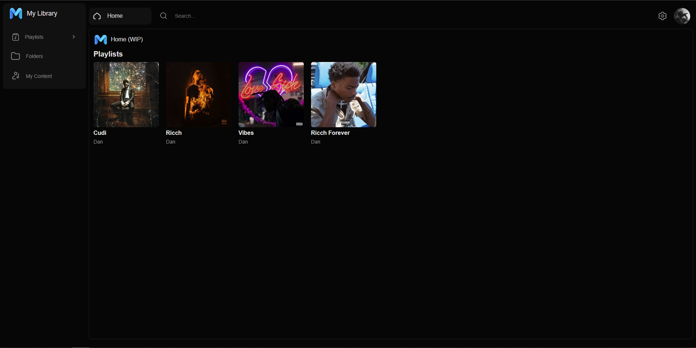
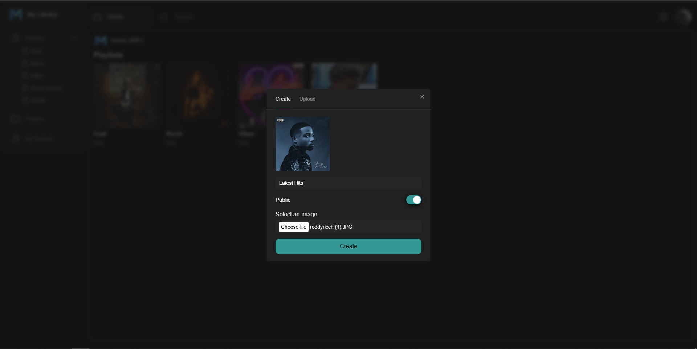

<h1 align="center">Melodiy</h1>
<p align="center"></p>

<p align="center">
  <a href="https://github.com/DNYLA/Melodiy/pkgs/container/melodiy-server"></a>
  <a href="https://melodiy.net"></a>
  <a href="https://github.com/DNYLA/Melodiy/issues"></a>
  <a href="/LICENSE"></a>
</p>

Open Source Music streaming platform which allows users to combine publicly released music with their files whilst still being able to access your music from anywhere. Currently uses Spotify Api (optional) and YouTube to search and listen to publicly released music.

Built using Next.js and C#, Desktop and mobile applications are on the way soon.

The official Melodiy.net, which runs on the latest `dev` build (there may be bugs, as new features are tested on here too): [https://melodiy.net/](https://melodiy.net/)

### Contents

- [Screenshots](#screenshots)
- [Setup](#set-up)
- [Contributing](CONTRIBUTING.md)
- [Getting Help](#getting-help)

# Screenshots

<p align="center">

| Homepage                                                   | Your Files                                                              |
| ---------------------------------------------------------- | ----------------------------------------------------------------------- |
|  |  |

| Create Playlist                                            | Upload Song                                                             |
| -----------------------------------------------------------| ----------------------------------------------------------------------- |
|  |  |

| Search                                                              | Artist                                                           |
| ------------------------------------------------------------------- | ---------------------------------------------------------------- |
|  |  |

| Right Click Menu (Your Files)                                          | Right Click Menu                                              |
| ---------------------------------------------------------------------- | ------------------------------------------------------------- |
|  |  |

</p>

# Set Up

## Production
Setup is straightforward you can pull the latest image using **docker pull ghcr.io/dnyla/melodiy:latest**

Pre-requisites
* Postgress Database
* Docker
* Spotify Api Key (Optional Remove the "Spotify" section in app settings if you don't want to include Spotify searches).
* Supabase Application (Optional remove the "Supabase" section in app settings if you don't want to use Supabase as the CDN).

1. pull the latest image using **docker pull ghcr.io/dnyla/melodiy:latest**
2. Copy docker-compose.yml and appsetting.json and edit appsetting.json to include your Supabase (optional), Spotify (optional) and Database settings.
3. docker compose up to run the server.

### Supabase
If you want to use supabase as the CDN you need to set up the following function within supabase. This will become obsolete in future versions as i plan on making changes to not write the full URL for each file into the database and instead use identifiers and generate the URL whenever requested.

1. On your project for supabase navigate to Database -> Functions -> Create new Function.
2. Setup the new function like below

| Key        | Value               |
|------------|---------------------|
| Name       | storage_file_exists |
| Schema     | public              |
| Return Type | bool               |
| Arg1       | path (text)         |
| Arg2       | bucket (text)       |
| Definition | 
```
BEGIN RETURN
  (SELECT EXISTS
     (SELECT id
      FROM storage.objects
      WHERE bucket_id=BUCKET
        AND name=PATH
      LIMIT 1));
END;
```


4. Leave everything else as default and click confirm.
5. Everything else (Bucket creation, database migrations, etc) will be handled by the server on every launch so no other setup is needed.

## Local Development

To setup local development you need to create an appsettings.development.json inside of the Melodiy.Web.

You will also need to setup a https development certificate so you can run the application using HTTPS. You can use this guide to generate a dotnet development certificate https://learn.microsoft.com/en-us/aspnet/core/security/docker-https?view=aspnetcore-8.0.

For windows i will write down the steps i used to produce a certificate that can be used within the docker container. If your using visual studio you can choose the startup type to be HTTPS and when its your first time starting the server you will be asked to trust and sign the certificate. However this won't work with docker any edits you make should be tested within the docker container however if you have problems with setting up and hosting the local development container i am more than happy to test it out for you as i wwill be verifying everything is still working within the container.

These steps are taken from the guide however i edited the command by adding a -t otherwise it woul the password is a placeholder if you change it don't forget to update docker-compose.dev.yml.

1. run dotnet dev-certs https -ep %USERPROFILE%\.aspnet\https\aspnetapp.pfx -p thepassword -v 
2. dotnet dev-certs https --trust
3. I use docker-compose -f docker-compose.dev.yml up --build --force-recreate to start the development container you might get away without having to use --build or --force-recreate everytime. I'm unfortunetely not a docker expert and had problems towards the start of development and using --build with --force-recreate seemed to fix all of my issues.

If you are using the local CDN you will notice files created locally don't work correctly when running the docker container. This is because the local files are stored in C:\ProgramData\Melodiy but the docker compose file mounts a new volume from the root folder inside the repo called files. For now i have been copying over C:\ProgramData\Melodiy into the files folder but will be looking at automatically mounting this in the future i just need to double check for linux development as the folder won't be C:\ProgramData\Melodiy on linux machines.

# Getting Help

If something isn't working for you or you are stuck, Create an [issue](https://github.com/DNYLA/Melodiy/issues/new) or [discussion](https://github.com/DNYLA/Melodiy/discussions) if you need any help with setting up or have bug fixes/feature requests. is the best way to get help! Every type of issue is accepted, so don't be afraid to ask anything!
